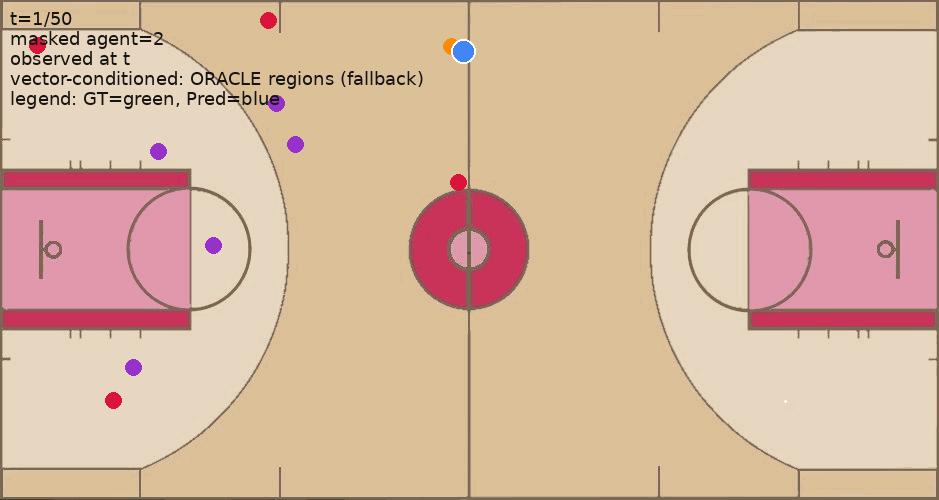

# 🏀 Text-Conditioned Trajectory Imputation (Basketball)

✨ **What this does**  
We take basketball tracking data and **hide one player’s movement** for a few seconds.  
The model then **fills in the missing path**, guided by a **text prompt** you write — like:

> *“the center set a screen near the foul line then rolled toward the goal post”*

--- 

Basketball tracking data is often incomplete — a player’s movement might be missing because of occlusion, sensor glitches, or data gaps. 📉
Traditional imputation methods try to automatically guess these missing paths, but they don’t let analysts inject their own knowledge of the game context. That can lead to predictions that feel unrealistic or detached from what actually happened on the court. 🧐

With text-conditioned imputation, we flip the script:
	•	📝 You (the analyst) describe what happened — e.g., “the center set a screen near the foul line then rolled toward the goal post.”
	•	🎛️ The model uses that prompt to generate a controllable, guided reconstruction of the missing trajectory.
	•	🧠 Instead of a black-box guess, you get imputations that align with your tactical knowledge or what you observed in the video.

This makes imputation not just accurate, but also interactive and analyst-driven — a big step beyond one-size-fits-all automation. 🚀


<p align="center">
  
</p>

- ✅ **Green path/dots** = Ground truth trajectory of the hidden player  
- 🔵 **Highlighted Blue path/dots** = Model’s prediction guided by your text  
- 🟥🟦 **Other players** = Shown in team colors (from ground truth)  
- ➡️ Offense moves **right → left**

---

## 📦 Dataset

We use basketball datasets from 👉 [**UniTraj-pytorch**](https://github.com/colorfulfuture/UniTraj-pytorch).  
This is a preprocessed version of the dataset from [Eric Zhan, et al.](https://github.com/ezhan94/calibratable-style-consistency).

Each file is a pickle containing a NumPy array shaped **(N, T, A, 2):**

- `N` = number of plays  
- `T` = timesteps  
- `A` = players per play  
- `(x, y)` = player coordinates (feet or normalized to `[0,1]`)  

If in feet, we auto-scale by `(x/94, y/50)`.

---

## 🎯 Why text conditioning?

Instead of just guessing, the model uses your **intent**:

- 📝 You write a short prompt describing the movement  
- 🔄 We translate it into **per-timestep grid regions**  
- 🎛️ The model gets those as **one-hot vectors (size 40)** alongside player positions and masks  
- 🧠 It predicts movements that better align with your description  

---

## 🗺️ Court Grid

- The court is split into an **8 (x) × 5 (y)** grid → **40 regions**  
- Each timestep, the masked agent is assigned to one grid cell (`ID = 0–39`)  
- The model conditions on this per-timestep **one-hot(40)** vector  

---

## ⚙️ Installation

```bash
# Python 3.9+ recommended
python -m venv .venv
source .venv/bin/activate        # Windows: .venv\Scripts\activate

pip install -r requirements.txt

If you want to use text prompts (--prompt), set your OpenAI key:

export OPENAI_API_KEY=your_key_here


---

🚀 Training

Train a baseline Transformer on UniTraj data:

python experiment.py \
  --train_traj /path/to/train_clean.p \
  --val_traj   /path/to/test_clean.p \
  --out_dir outputs \
  --epochs 30

	•	📂 Checkpoints: outputs/vec_xl_baseline/best.pt, last.pt
	•	📊 Results: outputs/results.csv (ADE, FDE, collisions, smoothness)
	•	📈 Logs: TensorBoard support included

---

🔮 Inference (make GIFs!)

📝 A) With text prompt (recommended)

python inference.py \
  --checkpoint outputs/vec_xl_baseline/best.pt \
  --traj_file /path/to/test_clean.p \
  --masked_agent 1 \
  --prompt "the center set a screen near the foul line then rolled toward the goal post" \
  --gif_out test.gif \
  --court_png court.png \
  --metrics

🔢 B) With explicit region IDs

python inference.py \
  --checkpoint outputs/vec_xl_baseline/best.pt \
  --traj_file /path/to/test_clean.p \
  --masked_agent 1 \
  --region_ids_json "[0,0,1,1,2,2,3,...]" \
  --gif_out test.gif \
  --court_png court.png \
  --metrics

🟩 C) With Oracle regions (ground truth; for testing)

python inference.py \
  --checkpoint outputs/vec_xl_baseline/best.pt \
  --traj_file /path/to/test_clean.p \
  --masked_agent 1 \
  --gif_out test.gif \
  --court_png court.png \
  --metrics


---

📐 Data shapes (for techies)

For each sample:
	•	x_in : (T, A*3 + 40)
	•	A*2 → player positions (masked coords zeroed)
	•	A   → observation flags (1=observed, 0=masked)
	•	40  → region one-hot for masked agent
	•	y_gt : (T, A*2)
	•	loss_mask : (T, A*2)

---

📊 Metrics
	•	ADE: Average displacement error
	•	FDE: Final displacement error
	•	Collision rate: % of times players overlap unrealistically
	•	Smoothness: Acceleration variance

---

🏁 TL;DR
	1.	📦 Download datasets from UniTraj-pytorch
	2.	⚙️ Train with experiment.py
	3.	✍️ Run inference.py with --prompt "your description"
	4.	🎞️ Check test.gif: green = ground truth, highlighted blue = prediction

---